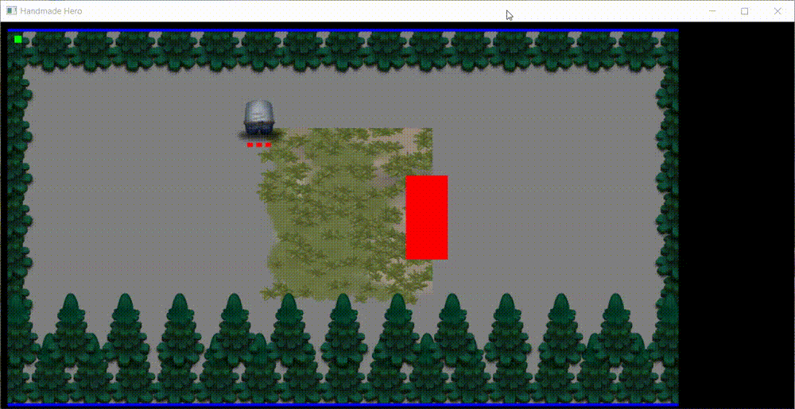

<div align="center">
  <h1>
    <a href="https://handmadehero.org/">Handmade Hero</a>
  </h1>


</div>

## Intro

This is my personal study notes of the awesome project [Handmade Hero](https://handmadehero.org).

If you think __writing a professional-quality game from scratch on your own (no engine no library)__ is interesting and challenging, I highly recommend this project.

In my opinion, it's **the best** I can find.

## Showcase

### Day 85



- We can jump 😉
- We can shoot 🔫
- We can go upstair and downstair 🏃‍♀️
- We have a big world and many rooms 🗺
- We have a basic procedure generated ground 🌿

## Env

Windows 10 with Visual Studio 2019 community version and Sublime Text 3.

Build system for Sublime Text 3:

```json
{
  "build_systems":
  [
    {
      "name": "HandmadeHero",
      "shell_cmd": "build",
      "file_regex":"^(.+?)\\((\\d+\\))(): (error)(.+)$"
    }
  ]
}
```

## Setup

NOTE: **This repo does not contain copyrighted HandmadeHero assets, to build this repo, please consider preorder HandmadeHero**.

- Create a `w` drive using subst: `subst w: /c/whatever_directory_you_choose`
- Clone this repo into the root of `w`
- Install Visual Studio 2019 community version
- cd into `w` and init cl: `.\handmade-hero\misc\shell.bat`
- Build and enjoy! `build`

## Code Style

My preferred code style for C is different from Casey's.

- snake_case for types, e.g. `game_world`
- camelCase for variables, e.g. `globalRunning`
- PascalCase for functions and macro functions, e.g. `GameUpdateVideo`
- UPPER_SNAKE_CASE for macro constants, e.g. `TILES_PER_CHUNK`
- Prefix an underscore to indicate that this function should only be called with a corresponding macro, e.g. `_PushSize`

## Marks

- `NOTE`: Something we need to pay attention to
- `PLAN`: Something we plan to do it later
- `RESOURCE`: External valuable resource
- `DIFF`: Something I have done it differently from Casey
- `FUN`: Something interesting to know, like Windows can't correctly handle file formats they invented
- `CASEY`: Casey's opinion about programming

## Game Programming

- Every memory allocation should go through a macro, it will make the debugging much easier.
- `Premultiplied Alpha`: check day 83 for more details.
- `Gamma Correction`: check day 94 for more details.
- `Transform Normal`: check day 102 for more details.

## Windows Programming

### Command Prompt

- `dir /s [keyword]`: search files
- `findstr -s -n -i -l [keyword]`: find strings

### Win32 API

- `WS_EX_TOPMOST`: make window in front of others
- `WS_EX_LAYERED` and `SetLayeredWindowAttributes `: change window alpha

### Visual Studio

- `Spy++`: inspect windows and messages

## TODO

- Fix full screen problem caused by systeml-level display scale
- Fix long running freeze bug: let the game run for a while and it will freeze
- Slow speed when moving across rooms

## Roadmap

<!-- MarkdownTOC -->

- [Day 1: Setting Up the Windows Build](#day-1-setting-up-the-windows-build)
- [Day 2: Opening a Win32 Window](#day-2-opening-a-win32-window)
- [Day 3: Allocating a Back Buffer](#day-3-allocating-a-back-buffer)
- [Day 4: Animating the Back Buffer](#day-4-animating-the-back-buffer)
- [Day 5: Windows Graphics Review](#day-5-windows-graphics-review)
- [Day 6: Gamepad and Keyboard Input](#day-6-gamepad-and-keyboard-input)
- [Day 7: Initializing DirectSound](#day-7-initializing-directsound)
- [Day 8: Writing a Square Wave to DirectSound](#day-8-writing-a-square-wave-to-directsound)
- [Day 9: Variable-Pitch Sine Wave Output](#day-9-variable-pitch-sine-wave-output)
- [Day 10: QueryPerformanceCounter and RDTSC](#day-10-queryperformancecounter-and-rdtsc)
- [Day 11: The Basics of Platform API Design](#day-11-the-basics-of-platform-api-design)
- [Day 12: Platform-Independent Sound Output](#day-12-platform-independent-sound-output)
- [Day 13: Platform-Independent User Input](#day-13-platform-independent-user-input)
- [Day 14: Platform-Independent Game Memory](#day-14-platform-independent-game-memory)
- [Day 15: Platform-Independent Debug File](#day-15-platform-independent-debug-file)
- [Day 16: Visual Studio Compiler Switches](#day-16-visual-studio-compiler-switches)
- [Day 17: Unified Keyboard and Gamepad Input](#day-17-unified-keyboard-and-gamepad-input)
- [Day 18: Enforcing a Video Frame Rate](#day-18-enforcing-a-video-frame-rate)
- [Day 19: Improving Audio Synchronization](#day-19-improving-audio-synchronization)
- [Day 20: Debugging the Audio Sync](#day-20-debugging-the-audio-sync)
- [Day 21: Loading Game Code Dynamically](#day-21-loading-game-code-dynamically)
- [Day 22: Instantaneous Live Code Editing](#day-22-instantaneous-live-code-editing)
- [Day 23: Looped Live Code Editing](#day-23-looped-live-code-editing)
- [Day 24: Win32 Platform Layer Cleanup](#day-24-win32-platform-layer-cleanup)
- [Day 25: Finishing the Win32 Prototyping Layer](#day-25-finishing-the-win32-prototyping-layer)
- [Day 26: Introduction to Game Architecture](#day-26-introduction-to-game-architecture)
- [Day 27: Exploration-based Architecture](#day-27-exploration-based-architecture)
- [Day 28: Drawing a Tilemap](#day-28-drawing-a-tilemap)
- [Day 29: Basic Tilemap Collision Checking](#day-29-basic-tilemap-collision-checking)
- [Day 30: Moving Between Tilemaps](#day-30-moving-between-tilemaps)
- [Day 31: Tilemap Coordinate Systems](#day-31-tilemap-coordinate-systems)
- [Day 32: Unified Position Representation](#day-32-unified-position-representation)
- [Day 33: Virtualized Tilemaps](#day-33-virtualized-tilemaps)
- [Day 34: Tilemap Memory](#day-34-tilemap-memory)
- [Day 35: Basic Sparse Tilemap Storage](#day-35-basic-sparse-tilemap-storage)
- [Day 36: Loading BMPs](#day-36-loading-bmps)
- [Day 37: Basic Bitmap Rendering](#day-37-basic-bitmap-rendering)
- [Day 38: Basic Linear Bitmap Blending](#day-38-basic-linear-bitmap-blending)
- [Day 39: Basic Bitmap Rendering Cleanup](#day-39-basic-bitmap-rendering-cleanup)
- [Day 40: Cursor Hiding and Fullscreen](#day-40-cursor-hiding-and-fullscreen)
- [Day 41: Overview of the Types of Math Used in Games](#day-41-overview-of-the-types-of-math-used-in-games)
- [Day 42: Basic 2D Vectors](#day-42-basic-2d-vectors)
- [Day 43: The Equations of Motion](#day-43-the-equations-of-motion)
- [Day 44: Reflecting Vectors](#day-44-reflecting-vectors)
- [Day 45: Geometric vs. Temporal Movement Search](#day-45-geometric-vs-temporal-movement-search)
- [Day 46: Basic Multiplayer Support](#day-46-basic-multiplayer-support)
- [Day 47: Vector Lengths](#day-47-vector-lengths)
- [Day 48: Line Segment Intersection Collision](#day-48-line-segment-intersection-collision)
- [Day 49: Debugging Canonical Coordinates](#day-49-debugging-canonical-coordinates)
- [Day 50: Basic Minkowski-based Collision Detection](#day-50-basic-minkowski-based-collision-detection)
- [Day 51: Separating Entities by Update Frequency](#day-51-separating-entities-by-update-frequency)
- [Day 52: Entity Movement in Camera Space](#day-52-entity-movement-in-camera-space)
- [Day 53: Environment Elements as Entities](#day-53-environment-elements-as-entities)
- [Day 54: Removing the Dormant Entity Concept](#day-54-removing-the-dormant-entity-concept)
- [Day 55: Hash-based World Storage](#day-55-hash-based-world-storage)
- [Day 56: Switching from Tiles to Entities](#day-56-switching-from-tiles-to-entities)
- [Day 57: Spatially Partitioning Entities](#day-57-spatially-partitioning-entities)
- [Day 58: Using the Spatial Partition](#day-58-using-the-spatial-partition)
- [Day 59: Adding a Basic Familiar Entity](#day-59-adding-a-basic-familiar-entity)
- [Day 60: Adding Hitpoints](#day-60-adding-hitpoints)
- [Day 61: Adding a Simple Attack](#day-61-adding-a-simple-attack)
- [Day 62: Basic Moving Projectiles](#day-62-basic-moving-projectiles)
- [Day 63 & 64 & 65 & 66: Major Refactoring with Simulation Region](#day-63--64--65--66-major-refactoring-with-simulation-region)
- [Day 67: Making Updates Conditional](#day-67-making-updates-conditional)
- [Day 68: Exact Enforcement of Maximum Movement Distances](#day-68-exact-enforcement-of-maximum-movement-distances)
- [Day 69: Pairwise Collision Rules](#day-69-pairwise-collision-rules)
- [Day 70: Exploration To-do List](#day-70-exploration-to-do-list)
- [Day 71: Converting to Full 3D Positioning](#day-71-converting-to-full-3d-positioning)
- [Day 72: Proper 3D Inclusion Test](#day-72-proper-3d-inclusion-test)
- [Day 73: Temporarily Overlapping Entities](#day-73-temporarily-overlapping-entities)
- [Day 74: Moving Entities Up and Down Stairwells](#day-74-moving-entities-up-and-down-stairwells)
- [Day 75: Conditional Movements Based on Step Heights](#day-75-conditional-movements-based-on-step-heights)
- [Day 76: Entity Heights and Collision Detection](#day-76-entity-heights-and-collision-detection)
- [Day 77: Entity Ground Points](#day-77-entity-ground-points)
- [Day 78: Multiple Collision Volumes Per Entity](#day-78-multiple-collision-volumes-per-entity)
- [Day 79: Defining the Ground](#day-79-defining-the-ground)
- [Day 80: Handling Traversables in the Collision Loop](#day-80-handling-traversables-in-the-collision-loop)
- [Day 81: Creating Ground with Overlapping Bitmaps](#day-81-creating-ground-with-overlapping-bitmaps)
- [Day 82: Caching Composited Bitmaps](#day-82-caching-composited-bitmaps)
- [Day 83: Premultiplied Alpha](#day-83-premultiplied-alpha)
- [Day 84: Scrolling Ground Buffer](#day-84-scrolling-ground-buffer)
- [Day 85: Transient Ground Buffers](#day-85-transient-ground-buffers)
- [Day 86: Aligning Ground Buffers to World Chunks](#day-86-aligning-ground-buffers-to-world-chunks)
- [Day 87: Seamless Ground Textures](#day-87-seamless-ground-textures)
- [Day 88: Push Buffer Rendering](#day-88-push-buffer-rendering)
- [Day 89: Renderer Push Buffer Entry Types](#day-89-renderer-push-buffer-entry-types)
- [Day 90: Bases Part 1](#day-90-bases-part-1)
- [Day 91: Bases Part 2](#day-91-bases-part-2)
- [Day 92: Filling Rotated and Scaled Rectangles](#day-92-filling-rotated-and-scaled-rectangles)
- [Day 93: Textured Quadrilaterals](#day-93-textured-quadrilaterals)
- [Day 94: Converting sRGB to Light-linear Space](#day-94-converting-srgb-to-light-linear-space)
- [Day 95: Gamma-correct Premultiplied Alpha](#day-95-gamma-correct-premultiplied-alpha)
- [Day 96: Introduction to Lighting](#day-96-introduction-to-lighting)
- [Day 97: Adding Normal Maps to the Pipeline](#day-97-adding-normal-maps-to-the-pipeline)
- [Day 98: Normal Map Code Cleanup](#day-98-normal-map-code-cleanup)
- [Day 99: Test Environment Maps](#day-99-test-environment-maps)
- [Day 100: Reflection Vectors](#day-100-reflection-vectors)
- [Day 101: The Inverse and the Transpose](#day-101-the-inverse-and-the-transpose)
- [Day 102: Transforming Normals Properly](#day-102-transforming-normals-properly)
- [Day 103: Card-like Normal Map Reflections](#day-103-card-like-normal-map-reflections)
- [Day 104: Switching to Y-is-up Render Targets](#day-104-switching-to-y-is-up-render-targets)
- [Day 105: Cleaning Up the Renderer API](#day-105-cleaning-up-the-renderer-api)
- [Day 106: World Scaling](#day-106-world-scaling)
- [Day 107: Fading Z Layers](#day-107-fading-z-layers)
- [Day 108: Perspective Projection](#day-108-perspective-projection)
- [Day 109: Resolution-Independent Rendering](#day-109-resolution-independent-rendering)
- [Day 110: Unprojecting Screen Boudaries](#day-110-unprojecting-screen-boudaries)
- [Day 111: Resolution-independent Ground Chunks](#day-111-resolution-independent-ground-chunks)
- [Day 112: A Mental Model of CPU Performance](#day-112-a-mental-model-of-cpu-performance)
- [Day 113: Simple Performance Counters](#day-113-simple-performance-counters)
- [Day 114: Preparing a Function for Optimization](#day-114-preparing-a-function-for-optimization)
- [Day 115: SIMD Basics](#day-115-simd-basics)
- [Day 116: Converting Math Operations to SIMD](#day-116-converting-math-operations-to-simd)
- [Day 117: Packing Pixels for the Framebuffer](#day-117-packing-pixels-for-the-framebuffer)
- [Day 118: Wide Unpacking](#day-118-wide-unpacking)

<!-- /MarkdownTOC -->


### Day 1: Setting Up the Windows Build

- Install Visual Studio 2019
- Call `vsdevcmd` to init command line tools
- Use `cl` to build our program
- Use `devenv` to start visual studio to debug. e.g. `devenv w:\build\win32_handmade.exe`
- `WinMain`: Entry of Windows program
- `MessageBox`: Show a message box

### Day 2: Opening a Win32 Window

- `WNDCLASS`, `RegisterClass`
- `GetModuleHandle`
- `OutputDebugString`
- `DefWindowProc`
- `CreateWindow`, `CreateWindowEx`
- `GetMessage`, `TranslateMessage`, `DispatchMessage`
- `BeginPaint`, `EndPaint`, `PatBlt`

### Day 3: Allocating a Back Buffer

- `PostQuitMessage`
- #define `global_variable` and `internal` to `static`
- Resize buffer when receive WM_RESIZE
- `GetClientRect`
- `CreateDIBSection`
- `StretchDIBits`
- `DeleteObject`
- `CreateCompatibleDC`
- `ReleaseDC`

### Day 4: Animating the Back Buffer

- Use `VirtualAlloc` to alloc bit map memory instead of `CreateDIBSection`
- `VirtualFree`, `VirtualProtect`
- Set `biHeight` to negative value so we the image origin if top-left
- Render a simple gradient. Each pixel has a value of form `0xXXRRGGBB`
- use `PeekMessage` instead of `GetMessage`, because it doesn't block
- `GetDC`, `ReleaseDC`

### Day 5: Windows Graphics Review

- `HREDRAW` and `VREDRAW` are used to tell Windows to redraw the whole window
- Use `win32_offscreen_buffer` to bundle all global variables
- Create the back buffer just once, move it out of `WM_SIZE`

### Day 6: Gamepad and Keyboard Input

- `XInput`, `XInputGetState`, `XInputSetState`, `XUSER_MAX_COUNT`
- Loading windows functions ourselves
- Use XInput 1.3
- `LoadLibrary`, `GetProcAddress`
- `WM_SYSKEYUP`, `WM_SYSKEYDOWN`, `WM_KEYUP`, `WM_KEYDOWN`
- Get IsDown and WasDown status from LParam

### Day 7: Initializing DirectSound

- Return `ERROR_DEVICE_NOT_CONNECTED` in xinput stub functions
- Implement `Alt+F4` to close the window
- Use bool32 if we only care if the value is 0 or not 0
- `dsound.h`, [IDirectSound8 Interface](https://docs.microsoft.com/en-us/previous-versions/windows/desktop/ee418035(v=vs.85))
- `DirectSoundCreate`, `SetCooperativeLevel`, `CreateSoundBuffer`, `SetFormat`
- Remember to clear `DSBUFFERDESC` to zero
- Add `MEM_RESERVE` to `VirtualAlloc`

### Day 8: Writing a Square Wave to DirectSound

- [IDirectSouondBuffer8 Interface](https://docs.microsoft.com/en-us/previous-versions/windows/desktop/ee418055%28v%3dvs.85%29)
- `Lock`, `Unlock`, `GetCurrentPosition`, `Play`

### Day 9: Variable-Pitch Sine Wave Output

- `sinf`
- `win32_sound_output`, `Win32FillSoundBuffer`
- `tSine`, `LatencySampleCount`
- We need to handle xinput deadzone in the future
- Use `DefWindowProcA` instead of `DefWindowProc`

### Day 10: QueryPerformanceCounter and RDTSC

- `QueryPerformanceCounter`, `LARGE_INTEGER`, `QuyerPerformanceFrequency`
- `wsprintf`, `__rdtsc`
- Intrinsic: looks like a function call, but it's used to tell the compiler we want a specific assembly instruction here

### Day 11: The Basics of Platform API Design

- Win32 platform todo list:
  - Saved game location
  - Getting a handle to our executable
  - Asset loading
  - Threading
  - Raw input (support for multiple keyboards)
  - Sleep/timeBeginPeriod
  - ClipCursor() (for multimonitor)
  - Fullscreen
  - WM_SETCURSOR (control cursor visibility)
  - QueryCancelAutoplay
  - WM_ACTIVATEAPP (for when we are not the active application)
  - Blit speed improvements
  - Hardware acceleration
  - GetKeyboardLayout (for French keyboards)
- For each platform, we will have a big [platform]\_handmade.cpp file. Inside this file, we #include other files.
- Treat our game as a service, rather than the operating system.

### Day 12: Platform-Independent Sound Output

- `_alloca`: Allocate some memory in the stack, freeed when the function exists rather than leave out of the enclosing scope
- Move sound rendering logic to handmade.cpp

### Day 13: Platform-Independent User Input

- Define `game_input`, `game_controller_input`, `game_button_state`
- Store OldInput and NewInput and do ping-pang at end of every frame
- Define `ArrayCount` macro

### Day 14: Platform-Independent Game Memory

- Use a `game_memory` struct to handle all memory related stuff
- We have permannent storage and trasient storage in our memory
- Define `Kilobytes`, `Megabytes` and `GigaBytes` macros
- We require the memory allocated to be cleared to zero
- Define `Assert` macro
- Use `cl -Dname=val` to define `HANDMADE_INTERNAL` and `HANDMADE_SLOW` compiler flags
- Specify base address when we do `VirtualAlloc` for debugging purpose in internal build

### Day 15: Platform-Independent Debug File

- Define `DebugPlatformReadFile`, `DebugPlatformWriteFile` and `DebugPlatformFreeFileMemory` only when we are using internal build
- Define `SafeTruncateUInt64` inline functions
- `CreateFile`, `GetFileSizeEx`, `ReadFile`
- `__FIEL__` is a compile time macro points to current file

### Day 16: Visual Studio Compiler Switches
- VS compiler switches:
  - `-WX`, `-W4`: enable warning level 4 and treat warnings as errors
  - `-wd`: turn off some warnings
  - `-MT`: static link C runtime library
  - `-Oi`: generates intrinsic functions.
  - `-Od`: disable optimization
  - `-GR-`: disable run-time type information, we don't need this
  - `-Gm-`: disable minimal rebuild
  - `-EHa-`: disable exception-handling
  - `-nologo`: don't print compiler info
  - `-FC`: full Path of Source Code File in Diagnostics
- Init `vsdevcmd` using `-arch=x86` flags to build a 32-bit version of our program
- Use `/link` to pass linker options to make a valid Windows XP executable
  - `-subsystem:windows,5.1`

### Day 17: Unified Keyboard and Gamepad Input

- Add one controller, so we have 5 controllers now
- Extract `CommonCompilerFlags` and `CommonLinkerFlags` in build.bat
- Copy old keyboard button state to new keyboard button state
- Add MoveUp, MoveDown, MoveLeft, MoveRight buttons
- Handle XInput dead zone
- Check whether union in game_controller_input is aligned

### Day 18: Enforcing a Video Frame Rate

- We need to find a way to reliably retrieve monitor refresh rate?
- We define `GameUpdateHz` based on `MonitorRefreshHz`
- Use `Sleep` to wait for the remaining time
- Use `timeBeginPeriod` to modify scheduler granularity

### Day 19: Improving Audio Synchronization

- Record last play cursor and write cursor
- Define `Win32DebugSyncPlay` to draw it
- Use a while loop to test direct sound audio update frequency

### Day 20: Debugging the Audio Sync

__The audio sync logic is indeed very hard and complicated__.

I didn't take many notes because I was really confused and I didn't understand much.

- Compute audio latency seconds using write cursor - play cursor
- Define `GameGetSoundSamples`

### Day 21: Loading Game Code Dynamically

- Compile win32_handmade and handmade separaely
- Define win32_game_code and
- Put platform debug functions to game memroy
- Enable `/LD` switch to build dll
- Use /EXPORT linker flags to export dll functions
- We don't need to define `DllMain` entry point in our dll
- extern "C" to prevent name mangling
- Turn off incremental link
- Use `CopyFile` to copy the dll

### Day 22: Instantaneous Live Code Editing

NOTE: `CopyFile` may fail the first time, We use a while loop to do it. This is debug code so We don't care the performance;

- Use /PDB:name linker options to specify pdb file name
- Add timestamp to output pdb file name
- Delete PDB files and pipe del output to NUL
- Use `FindFirstFile` to get file write time
- Use `CompareFileTime` to compare file time
- Use `GetModuleFileName` to get exe path and use it to build full dll path
- We can use MAX_PATH macro to define length of path buffer

### Day 23: Looped Live Code Editing

- Define `win32_state` to store InputRecordIndex and InputPlayingIndex, we only support one slot now
- Press L to toggle input recording
- Store input and memory into files
- Use a simple jump to test our looped editing
- We can use `WS_EX_TOPMOST` and `WS_EX_LAYERED` to make our window the top most one and has some opacity
- We can do it in `WM_ACTIVATEAPP` message so when the game loses focus it will be transparent

### Day 24: Win32 Platform Layer Cleanup

- Fix the audio bug (I have already fixed that in previous day)
- Change blit mode to 1-to-1 pixles
- Use `%random%` for pdb files
- Change compiler flag `MT` to `MTd`
- Store EXE directory in Win32State and put record input file to build dir
- Use `GetFileAttributeEx` instead of `FindFirstFile` to get last write time of a file

### Day 25: Finishing the Win32 Prototyping Layer

- Use `GetDeviceCaps` to get monitor refresh rate
- Pass `thread_context` from platform to game and from game to platform
- Add mouse info to game_input, using `GetCursorPos`, `ScreenToClient`
- Record mouse buttons using `GetKeyState`
- Define win32_replay_buffer and store game state memory in memory using `CopyMemory` (Storing in disk actually is very fast in my computer, but I am gonna do it anyway)
- I am not gonna do memory mapping, because I think it's unnecessary

### Day 26: Introduction to Game Architecture

Today there isn't any code to write. I am just listening to Casey talking about what a good game architecture looks like.

In Casey's view, game architect is like a __Urban Planner__. Their job are organizing things roughly instead of planning things carefully. I can't agree more.

### Day 27: Exploration-based Architecture

- Add `SecondsToAdvanceOverUpdate` to game_input
- Remove debug code
- Turn off warning C4505, it's annoying. We are gonna have unreferenced local functions.
- Target resolution: 960 x 540 x 30hz
- Define `DrawRectangle`

### Day 28: Drawing a Tilemap

- Use floating point to store colors, because it will make it a lot more eaiser when we have to do some math about colors
- Draw a simple tilemap
- Draw a simple player, keep in mind that player's moving should consider the time delta. Otherwise it will move fast if we run at a higher FPS.

### Day 29: Basic Tilemap Collision Checking

- Using `PatBlt` to clear screen when display our buffer
- We should only clear the four gutters otherwise there will be some flashing
- Implement a simple collision check
- Seperate the header file into handmade.h and handmade_platform.h

### Day 30: Moving Between Tilemaps

- Define four tilemaps, and notice that in C the two dimension array is Y first and X last
- Define `canonicol_position` and `raw_postion`
- Implement moving between tilemaps

### Day 31: Tilemap Coordinate Systems

- NOTE: Basically any CPU we are gonna target at has SSE2
- Define `handmade_intrinsic.h`
- Define `TileSizeInMeters` and `TileSizeInPixels`
- Optimization switches: `/O2 /Oi /fp:fast`
- PLAN: Pack tilemap index and tile index into a single 32-bit integer
- PLAN: Convert TileRelX and TileRelY to resolution independent world units
- RESOURCE: Intel Intrinsics Guide, https://software.intel.com/sites/landingpage/IntrinsicsGuide/

### Day 32: Unified Position Representation

- Remove `raw_position`
- Add `canonical_postion PlayerPos` to game state
- Define `RecononicalizePosition`
- Use meters instead of pixels as units

### Day 33: Virtualized Tilemaps

- Rename `canonical_position` to `world_position`
- Make Y axis go upward
- RESOURCE: a great book about typology: *Galois' Dream: Group Theory and Differential Equations*
- Remove TileMapX and TileMapY
- Define `tile_map_position`
- 24-bit for tilemap and 8-bit for tiles
- Implement a simple scroll so the guy can move

### Day 34: Tilemap Memory

- Implement smooth scrolling
- Implement a way to speed the guy up
- Make `TileRelX` and `TileRelY` relative to center of tile
- Create `handmade_tile.h` and `handmade_tile.cpp`
- Rename `tile_map` to `tile_chunk` and extract everything from `world` to `tile_map`, now tilemap means the whole map
- Define `memory_arena` and `PushSize`, `PushArray` and create tile chunks programmatically

### Day 35: Basic Sparse Tilemap Storage

- Make tile size small so we can see more chunks
- Remove `TileSizeInPixels` and `MetersToPixels` from `tile_map`
- Use random.org to generate some random numbers and use them to generate screen randomly
- Generate doors based on our choice
- Allocate space for tiles only when we access
- Add Z index to tilemap

### Day 36: Loading BMPs

- FUN: Windows can't render BMPs correct. This is very amusing, because they are the guys who invented BMP.
- Make player go up and down. I already implemented this function in the previous day, but I need to reimplement it in a new way: when the player moves to the stair, it goes automatically, no need to push any button.
- Rename `TileRelX` and `TileRelY` to `OffsetX` and `OffsetY`
- Define `bitmap_header` and parse bitmap. We have to use `#pragma pack(push, 1) and #pragma pack(pop)` to make vs pack our struct correctly

### Day 37: Basic Bitmap Rendering

- Design a very specific BMP to help debug our rendering. This is a very clever method.
- I find that my structured_art.bmp has different byte order from casey's. It turns out that BMP has something called RedMask, GreenMask, BlueMask and AlphaMask.
- BMP byte order: should determined by masks
- Render background bmp
- Define `loaded_bitmap` to pack all things up
- Define `DrawBitmap`

### Day 38: Basic Linear Bitmap Blending

- Define `FindLeastSignificantSetBit` and `bit_scan_result` in intrinsics
- Define `COMPILER_MSVC` and `COMPILER_LLVM` macro variables
- Use `_BitScanForward` MSVC compiler intrinsic when we are using windows
- Implement a simple linear alpha blending
- Assert compression mode when loading BMP

### Day 39: Basic Bitmap Rendering Cleanup

- Load hero bitmaps for four directions
- Change hero direction when moves
- Align hero bitmaps with real position
- Replace camera scrolling with fixed camera
- Move camera when player moves
- Fix clipping problem in our bitmap drawing
- Check frame rate
- Fix msvc pdb problem when hot reloading by creating a lock file

### Day 40: Cursor Hiding and Fullscreen

- Write a `static_check` bat file to make sure we never type `static`
- Set a default cursor style using `LoadCursor`
- Hide cursor by responding `WM_SETCURSOR` message with `SetCursor(0)` in production build
- RESOURCE: How do I switch a window between normal and fullscreen? https://devblogs.microsoft.com/oldnewthing/20100412-00/?p=14353
- Implement full screen toggling
- Do fullscreen rendering in fullscreen mode

### Day 41: Overview of the Types of Math Used in Games

Math we are gonna need:

- Arithmetic
- Algebra
- Euclidean Geometry
- Trigonometry
- Arithmetic
- Calculus
- Linear Algebra
- Partial Differential Equation
- Ordinary Differential Equation
- Complex Numbers
- Non-Euclidean Geometry
- Topology
- Minkowski Algebra
- Control Theory
- Interval Arithmetic
- Graph Theory
- Operations Research
- Probability and Statistics
- Cryptography / Pseudo Number Generator

### Day 42: Basic 2D Vectors

- Fix diagonal movement problem
- Define `v2` and implement add operator, minus operator and unary minus operator in `handmade_math.h`
- Use v2 instead of x and y

### Day 43: The Equations of Motion

- Add `dPlayerP` to game state. This is the speed of the guy.
- Add a back force based on player's speed

### Day 44: Reflecting Vectors

- Implement inner product for vectors
- Reflect speed when player hits the wall (or make the speed align the wall). This can be implemented by a clever verctor math `v' = v - 2 * Inner(v, r) * r`. r means the vector of the reflecting direction. For bottom wall, r is `(0, 1)`.

### Day 45: Geometric vs. Temporal Movement Search

- CASEY: Search in p (position) is way better than searing in t (time)
- Part of new collision detection algorithm
- There is no code today. I will write the new collision detection algorithm when it's complete.

### Day 46: Basic Multiplayer Support

- We have a severe bug! Player has been moved multiple times!
- Define `entity` struct. Add `Entities`, `EntityCount`, `PlayerIndexForController` and `CameraFollowingEntityIndex` to game state
- Support as many players as our controllers in game state
- Implement `RotateLeft` and `RotateRight` intrincsics using `_rotl` and `_rotr`

### Day 47: Vector Lengths

- Define `Length`, `SquareRoot` to fix diagonal movement problem
- We will ue **search in t instead of search in p**. Because to implement the later, we have to build the whole search space. It's complex and doesn't pay off.
- Part of new collision detection algorithm

### Day 48: Line Segment Intersection Collision

- Implement the new collistion detection algorithm
- Add a `tEpsilon` to tolerate floating point problem

### Day 49: Debugging Canonical Coordinates

- Add an `Offset` method to manipulate tile map position and auto recononicalize
- Maybe we shouldn't make the world toroidal, since it adds much complexity

### Day 50: Basic Minkowski-based Collision Detection

- Introduction of Minkowski sum and GJK algorithm
- Implement area collision detection
- Take player area into account when calculating MinTileX, MaxTileX, MinTileY and MaxTileY
- Modify speed when player hits the wall
- Use a loop to move player

### Day 51: Separating Entities by Update Frequency

- Divide entities into high, low and dormant categories
- Define `entity_residence` enum
- Casey did part of the new implementation
- No code today. I will wait till the new implementation is finished

### Day 52: Entity Movement in Camera Space

- Make player move again
- Map float position to tile map position after moving player
- Make camera move again

### Day 53: Environment Elements as Entities

- Define `SetCamera` and move entities into/out of high set
- Define `entity_type` and add wall entities
- Remove `tRemaining` in collision detection

### Day 54: Removing the Dormant Entity Concept

- Remove dormant entity and entity residence concept
- Define `MakeEntityHighFrequency` and `MakeEntityLowFrequency`
- Make code work again
- DIFF: I don't like all the index thing. I will use pointers instead.

### Day 55: Hash-based World Storage

- Use int32 as chunk index, so 0 will be the center.
- Add `TileChunkHash` to tile map
- `GetTileChunk` should take a memroy arena
- DIFF: I will store pointers instead of index in TileChunkHash array

### Day 56: Switching from Tiles to Entities

- Rename `CameraBound` to `HighFrequencyBound`
- Rename `handmade_tile.h/cpp` to `handmade_world.h/cpp`
- Rename tile chunk to world chunk. We dont have *tiles* anymore.

### Day 57: Spatially Partitioning Entities

- There is no tiles any more, just chunks.
- Define `entity_block` and `ChangeEntityLocation`
- Implement `WorldPositionFromTilePosition`

### Day 58: Using the Spatial Partition

- Reimplement `SetCamera` using spatial partition
- Call `ChangeEntityLocation` when adding low entities
- Load tree bitmap and render it as wall

### Day 59: Adding a Basic Familiar Entity

- Add monster and familiar entity type
- Define `entity_render_piece` and `entity_render_piece_group`
- Implement `UpdateFamiliar`

### Day 60: Adding Hitpoints

- Define `hit_point` struct
- Draw hit points
- Define `v3` and `v4` vectors

### Day 61: Adding a Simple Attack

- CASEY: Always write the usage code first. It will prepare you necessary context for writing real stuff.
- Add `EntityType_Sword` entity type
- Define `DrawHitPoints()` and `InitHitPoints()` and add hitpoints for our monster
- Load *rock03.bmp* as sword and render it when some key is pressed
- Define `NullPosition()` and `IsPositionValid()`. Use some specific value to represent a null position.

### Day 62: Basic Moving Projectiles

- Define `move_spec` and pass it to `MoveEntity`
- Add `distanceRemaining` to sword
- Define `UpdateSword` and make sword disappaer when distance remaining reaches to zero

### Day 63 & 64 & 65 & 66: Major Refactoring with Simulation Region

This is a big change but it defeinitely worth it.

- Remove `low_entity` and `high_entity`. They are never a good idea.
- Define `sim_entity` and `stored_entity`. `stored_entity` is for storage and `sim_entity` is for simulation.
- Every frame, pull relevant entities to our simulation region, simulate it and render it.
- Lots of modifications adjusted for this new model

### Day 67: Making Updates Conditional

- Add `updatable` to sim entity and set it correspondingly
- Add `updatableBounds` to sim region. Previous bounds becomes total bounds.
- `LoadEntityReference` should get position from reference entity
- `UpdateSword` doesn't have to check NonSpatial flag
- Move update logic back to our main function
- CASEY: Avoid callbacks, plain switch statements are just better on every aspect.

### Day 68: Exact Enforcement of Maximum Movement Distances

- Consider `distanceLimit` in moveEntity function
- CASEY: Fight the double dispatch problem with a property system.
- Define a simple `HandleCollision` function to make sword hurt monster when they collides

### Day 69: Pairwise Collision Rules

- Remove `EntityFlag_Collides`
- Define `ShouldCollide` to check whether two entities should collide
- Define `pairwise_collision_rule`
- Add `collisionRuleHash` and `firstFreeCollisionRule` to game state
- Define `AddCollisionRule` and `ClearCollisionRulesFor`

### Day 70: Exploration To-do List

- One way to fix `ClearCollisionRulesFor` function: every time we just insert two entries so that we can query with each one.

To-do list:

- Multiple sim regions per frame
  - Per-entity clocking
  - Sim-region merging? For multiple players?
- Z!
  - Clean up things by using v3
  - Figure out how you go "up" and "down", and how is this rendered?
- Collision detection?
  - Entry/exit?
  - What's the plan for robustness? / shape definition?

- Debug code
  - Logging
  - Diagramming
  - Switches / slides / etc.

- Audio
  - Sound effect triggers
  - Ambient sounds
  - Music
- Asset streaming

- Metagame / save game?
  - Do we allow saved games? Probably yes, just only for "pausing".
  - Continuous save for crash recovery?
- Rudimentary world generation
  - Placement of background things
  - Connectivity?
  - Non-overlapping
  - Map display
    - Magnets - how they work???
- AI
  - Rudimentary monster behavior example
  - Path finding
  - AI "storage"

- Animation system
  - Skeletal animation
  - Partical system
- Rendering
- GAME
  - World generation
  - Entity system

### Day 71: Converting to Full 3D Positioning

- Remove `world_diff`
- Remove `chunkSizeInMeters` and add `chunkDimInMeters`
- Define `Hadamard` for v2 and v3
- Make `p` and `dP` v3 in sim entity
- Define `rectangle3`

### Day 72: Proper 3D Inclusion Test

- Implement the simple jump (Casey implemented this long time ago)
- `AABB`: Axis aligned bounding boxes
- Add `maxEntityRadius`, `maxEntityVelocity` to sim region
- Change `width` and `height` in sim entity to `dim`
- Define `EntityOverlapsRectangle` and use this method to test whether entity is inside a rectangle

### Day 73: Temporarily Overlapping Entities

- Add `EntityType_Stairwell` and use rock_02 bmp as our stairwell asset
- Implement `AddStair` and draw our stair
- Define `overlappingCount` and `overlappingEntites` and `RectanglesIntersect`
- Pass `wasOverlapping` to `HandleCollision`
- Move `AddCollisionRule` to handle collision

### Day 74: Moving Entities Up and Down Stairwells

- Remove overlapping stuff and define `CanOverlap` and `HandleOverlap`
- Rename `ShouldCollide` to `CanCollide`
- Call `HandleOverlap` at the end of `MoveEntity`
- Draw our stairwell as a rectangle
- Define `GetBarycentric`
- Define `SafeRatioN`, `SafeRatio0` and `SafeRatio1`
- Define `Lerp`
- Add `EntityFlag_Moveable`
- Rename `AddFlag` -> `AddFlags`, `ClearFlag` -> `ClearFlags`
- Define `Clamp` and `Clamp01`
- Fix `BeginSim` to loop over chunkZ
- Modify stairwell z so that the minimum z of its volumn is 0

### Day 75: Conditional Movements Based on Step Heights

- Add `EntityFlag_ZSupported`
- Prevent player from "jumping" when he goes up/down stairs
- Define `SpeculativeCollide` to prevent hero from stepping out the stair and jumping into the stair
- Add `zFudge` when rendering

### Day 76: Entity Heights and Collision Detection

- Take into account `z` in `MoveEntity`. Remember to set height for walls.
- Change `TileDepthInMeters`, currently it's just the same as `TleSizeInMeters`.
- Modify `RectanglesIntersect`
- Define `AddGroundedEntity`
- TODO: need to fix the rendering!

### Day 77: Entity Ground Points

- Fix ground handling, need to take the z dimension into account
- Fix the drawing code
- Define `GetEntityGroundPoint` and fix `SpeculativeCollide`
- Add `walkableHeight` to entity which is used only for stairwell, and modify `SpeculativeCollide`
- Define `GetStairwellGround` and fix `HandleOverlap`. It should use the same method to calculate the stairwell ground as `SpeculativeCollide`.

### Day 78: Multiple Collision Volumes Per Entity

- The position point doesn't necessarily have to be the collision point
- Define `sim_entity_collision_volume` and `sim_entity_collision_volumn_group`
- Remove `dim` in entity and add `collision`
- Define `walkableDim` for stairwell
- Initialize collision groups when initialize memory
- Always initialize collistion to null collision
- Set z drag to 0

### Day 79: Defining the Ground

- Casey talks about difference between "filled and carve" (Quake way) vs "empty and fill" (Unreal way) model
- CASEY: Robustness > efficiency!
- Introduce the concept of "room"
- Define `AddStandardRoom`
- Define `PushRectOutline` to draw the room

### Day 80: Handling Traversables in the Collision Loop

- Define `test_wall` and make wall testing data driven
- Inline `TestWall` function
- Test overlap using all volumes and extract code into `EntitiesOverlap`
- Add `epsilon` to `EntitiesOverlap`
- Add test for `tMax`, mostly the same as `tMin`
- Test our new code that prevents hero from ever getting outside

### Day 81: Creating Ground with Overlapping Bitmaps

- Load grass, ground and tuft bitmaps
- Define `DrawTest` and randomly draw some grasses, grounds and tufts
- Casey talks about megatexture

### Day 82: Caching Composited Bitmaps

- Make random number more systemic
  - define `random_series`
  - define `Seed`, `RandomChoice`, `RandomUnilateral`, `RandomBilateral`, `RandomBetween`
  - replace old random code with above new functions
- Make `loaded_bitmap` has the same structure as `game_offscreen_buffer` and all drawing functions previously taking game_offscreen_buffer now take loaded_bitmap
- Define `MakeEmptyBitmap`, remember to clear the data to zero!
- Draw ground bitmap once and cache it in game state

### Day 83: Premultiplied Alpha

- Casey explains what premultiplied alpha is
- Change `LoadBMP` and `DrawBitmap` function to use premultiplied alpha
- Handle `cAlpha` in `DrawBitmap`

### Day 84: Scrolling Ground Buffer

- Add `groundBufferP` and draw ground based on this position
- Rename `DrawTest` to `DrawGroundChunk` and fill the whole buffer

### Day 85: Transient Ground Buffers

- Introduce `transient_state` to help manage transient memory
- Define `transientArena` and store multiple ground buffers in transient memory
- Use `groundBitmapTemplate` to store repeated info (width, height) about the ground buffer
- DIFF: Casey uses `beginTemporaryMemory` and `endTemporaryMemory` calls to restore memory space used only in one frame. I think the api is not easy to use, I implement `save` and `restore` just like in the `CanvasRenderingContext2D`.
- Draw ground buffers

### Day 86: Aligning Ground Buffers to World Chunks

- Make world position `_offset` relative to center point, and rename it to be `offset`. There is no need to prefix it with the underscore.
- Draw chunks to see how big it is
  - Define `CenteredChunkPoint`
  - Define `DrawRectangleOutline`
- Change `metersToPixels` to a fixed number
- Cleanup: remove tileSideInMeters, we no longer have any tile thing.
- Fill ground buffer for each chunk.

### Day 87: Seamless Ground Textures

- Modify `FillGroundBuffer` to generate seamless grounds by iterating nine chunks each time
- Select the furthest buffer and fill it if we have run out of buffers
- Decrease `groundBufferCount` to test our eviction code
- Regenerate ground when game reloading
  - Add a field `executableReloaded` in game_input to tell us whether game has reloaded
- Why the trees are wiggling around?
  - Our bliting is not pixel perfect now, entities' float coordinates may round to different integers and cause their distance to change a little bit.
  - We will solve this problem when we have a real renderer!

### Day 88: Push Buffer Rendering

- Clean up rendering stuff
  - Create `handmade_render_group.h` and `handmade_render_group.cpp` file
  - Put `render_piece` and `render_piece_group` to our newly created file
  - Increase piece count in piece group and use transient arena to alloc our piece group
  - Define `render_basis`
  - Delayed rendering: render pieces after we have pushed them all
- Use delayed rendering for ground buffers
- Rename `render_piece_group` to `render_group`
- Implement push buffer
  - Add `pushBufferBase`, `pushBufferSize` and `maxPushBufferSize` to render_group
  - Define `AllocateRenderGroup` and `PushRenderElement`

### Day 89: Renderer Push Buffer Entry Types

- Why we use a push buffer to do the rendering?
  - Sorting!
  - Process the source buffer into someting most suitable for the target
- Architect our soft renderer the way actual GPU works
- Move all drawing functions to handmade_render_group.cpp
- Rename `render_piece` to `render_entry`
- Define `RenderGroupToOutput`
- Use "compact discriminated union"
  - `render_entry_clear`
  - `render_entry_rectangle`
  - `render_entry_bitmap`
- Define `render_entity_basis` to abstract common positioning logic
- RESORUCE: [The ryg blog](https://fgiesen.wordpress.com/)

### Day 90: Bases Part 1

- Implement `Clear`
- Implement `PushRectOutline`
- Use `PushBitmap` in `FillGroundBuffer`

### Day 91: Bases Part 2

- Casey explains what is a basis and how it works
- Implement a demo `render_entry_coordinate_system` to explore the basis transformation idea

### Day 92: Filling Rotated and Scaled Rectangles

- Collision detection has a lot to do with pixel filling
- Casey demonstrates how to fill a rectangle
  - Define `DrawRectangleSlowly`
  - Start from an aligned rectangle
  - Move to a rotated rectangle
  - Calculate the min/max bound rather than always check the whole buffer
  - Define `Perp` function

### Day 93: Textured Quadrilaterals

- Implement a textured quadrilaterals
  - For each pixel, calculate the `u` and `v` uniform coordinate
  - Use `u` and `v` to get color from texture
  - Populate pixel with that color
  - Implement alpha blending, just copy the old code
- Subpixel rendering
  - Casey demonstrates wiggling
  - And then solve it by **Bilinear Texture Filtering**

### Day 94: Converting sRGB to Light-linear Space

- Casey explains what _Gamma Space_ is
  - It's non linear and it makes our math broken
- RESOURCE
  - [Linear-Space Lighting (i.e. Gamma)](http://wiki.polycount.com/w/images/0/0e/John_Hable_-_Linear-Space_Lighting_%28i.e._Gamma%29.pdf)
  - [Lighting Shading by John Hable](https://www.slideshare.net/naughty_dog/lighting-shading-by-john-hable)
- Use `pow(2.2)` and `sqrt(2.2)` to convert between sRGB and linear space
  - `pow(2.2)` is just a good approximation, is **not** suitable for all monitors
  - We use `pow(2)` to approximate `pow(2.2)` because it's much more cheaper
- Implement `SRGB255ToLinear1` and `Linear1ToSRGB255`
- Implement a simple color tint

### Day 95: Gamma-correct Premultiplied Alpha

- When we load a BMP
  - Convert it to linear space
  - Multiply alpha with the color
  - Convert it back to sRGB space
- Remove `render_entry_header` in render entry types
  - Add this header in every render entry type is very error-prone
  - Let's the `PushRenderElement` function do this job
- `-Zo` used for [enhanced optimized code debugging](https://docs.microsoft.com/en-us/cpp/build/reference/zo-enhance-optimized-debugging?view=msvc-160)

### Day 96: Introduction to Lighting

I am reading this book [Computer Graphics from Scratch](https://gabrielgambetta.com/computer-graphics-from-scratch/) these days, it's a good source to learn about lighting.

- Only render render_entry_coordinate_system and turn the optimization flag off
- Doug Church: Lighting is the sound of graphics.
- Casey explains things about lighting and there are so many terms I don't understand...
- Get lighting fully right is extremely hard
- Lighting problems in 2D
  - We don't know what the surfaces are
    - normal maps
  - We don't know what the light field is
    - point lights
    - light rendering
- RESOURCE: A good book about lighting [Physically Based Rendering:From Theory To Implementation](http://www.pbr-book.org/)

### Day 97: Adding Normal Maps to the Pipeline

- Introduce normal map and environment map
  - Define `environment_map`
  - Add top, middle and bottom environment map and normal map to `DrawRectangleSlowly`
- Define `SampleEnvironmentMap`
- Define `MakeSphereNormalMap` to generate a fake normal map and test our code

### Day 98: Normal Map Code Cleanup

- There are two types of bitmaps: front-facing bitmaps and up-facing bitmaps
- Clean up previous code

### Day 99: Test Environment Maps

- Initialize top, middle and bottom env maps
- Note: Out roughness is always zero now
- Fill LOD with color and draw the LODs
- Fill LOD with checker board
- Define testDiffuse and testNormal to test our lighting program
- Casey demonstrates how to change saturation
  - avg = (r + g + b)/3
  - delta = (r - avg, g - avg, b- avg)
  - color = avg + saturationLevel * dela

### Day 100: Reflection Vectors

- Calc the reflection vector: -e + 2Inner(e, N)N
- Modify `SampleEnvironmentMap`
  - Take the reflection vector as input
  - Define distanceFromMapInZ, let's say it's 1.0f
  - Define uvsPerMeter, let's say it's 0.01f
  - Calculate the point in the environment map and get color from it

### Day 101: The Inverse and the Transpose

This is a math day. Casey explains matrices and other stuff of linear algebra.

Speaking abuot lingear algebra, I highly recommond this book [Linear Algebra by Jim Hefferon](https://hefferon.net/linearalgebra/). It's freely available and totally accessible.

Inverse of a rotation matrix:

```
X and Y are perpendicular unit vectors.

R =
Xx Yx
Xy Yy

R inverse = R' =
Xx Xy
Yx Yy

Based on this fact:

XxXx +XyXy = Inner(X, X) = 1

XxYx + XyYy = Inner(X, Y) = 0

YxXx + YyXy = Inner(X, Y) = 0

YxYx + YyYy = Inner(Y, Y) = 1

So R' R =

1 0
0 1
```

### Day 102: Transforming Normals Properly

Because normals are perpendicular to vectors, they are affected in a perpendicular way by any transforms we do.

- Rotate the normal
- Document `SampleEnvironmentMap` function
- Paint the LOD to debug SampleEnvironmentMap

### Day 103: Card-like Normal Map Reflections

In a 2D perspective, things are intentionally wrong, because the art wants them to be different.

- Fix `DrawRectangleSlowly`
  - Calculate the correct screenSpaceUV
  - Add `z` in environment_map
  - Set `z` for environment maps
- There are two types of cards:
  - lying-down card
  - standing-up card
- Define `MakeSphereDiffuseMap`
- TODO: The mechanism of lighting is very confusing for me now, need to review them later.

### Day 104: Switching to Y-is-up Render Targets

- Switch to Y-up render targets. I don't need to do anything cause I did this long before.

### Day 105: Cleaning Up the Renderer API

- Pull out render api
  - Remove `PushPiece`
  - Make alignment baked in the bitmap
  - Remove `entityZC`
  - Unify v2 offset and offsetZ into v3 offset
  - `PushBitmap` should accept a v4 color

### Day 106: World Scaling

- Use `DrawRectangleSlowly` to render bitmap so we can scale
- Store `zOffset` in game state and control it using action up/down buttons
- Scale the position and size based on Z
- Remove y offset caused by z
  - Z Slices are what control the _scaling_ of things, where Z offsets inside a slice are what control Y offseting

### Day 107: Fading Z Layers

- Remove `zOffset` in game_state
- Do not preserve the offset z of cameraP
- Add `globalAlpha` to render group
- Fade entities based on its z value
  - Define `fadeTopStartZ`, `fadeTopEndZ`, `fadeBottomStartZ` and `fadeBottomEndZ`
  - Define `Clamp01MapToRange`
- Modify `cameraBounds`

### Day 108: Perspective Projection

- Change `GetEntityRednerBasisResult` function to implement proper perspective projection
  - the core formula: p' = (dp) / (Cz - Pz)
  - NOTE: the `cameraP` in game_state is where we are looking at, not the actual camera position

### Day 109: Resolution-Independent Rendering

- Change `align` to `alignPercentage`
- Add `widthOverHeight` to loaded_bitmap
- Remove `metersToPixels` in game_state
- `PushBitmap` should take a `height` param
- Add `size` to render_entry_bitmap
- Add `screenDim` param to `GetEntityRenderBasisResult`

### Day 110: Unprojecting Screen Boudaries

- Define `GetCameraRectangleAtDistance`
  - Define `Unproject`
- Add `MetersToPixels` to render group and it means meters on the monitor into pixels on the monitor
- Use `PushRectOutline` to verify our GetCameraRectangleAtDistance returns correct value
- Define `render_group_camera`
  - Add `gameCamera` and `renderCamera` to render group
  - Now we can see the big picture of our game world

### Day 111: Resolution-independent Ground Chunks

- Reenable ground buffer code
- Make ground the same size as the chunk
- Define another LoadBMP call to set a default center align
- Use meters in `FillGroundBuffer`

### Day 112: A Mental Model of CPU Performance

This is a blackboard day. No code evolved.

- SIMD is everywhere
- Modern CPUS are heavily heavily out of order
- Casey explains the difference between latency and throughput
- In most cases, we only care the throughput not the latency.

### Day 113: Simple Performance Counters

- Basic process of making things run quickly
  - Gather statistics
    - where it is slow
    - what are their characteristics
  - Make an estimation
  - Analyze "efficiency" and "performance"
    - "efficiency" is about how much work we have to do
    - "performance" is about how to make the CPU do the work
  - Start coding
- Define `BEGIN_TIMED_BLOCK` and `END_TIMED_BLOCK` macros to track performance
- Define `debug_cycle_counter` struct to store counters
- Define `HandleDebugCounters` to display counters

### Day 114: Preparing a Function for Optimization

- Copy `DrawRectangleSlowly` to `DrawRectangleHopefullyQuickly`
- Flatten `DrawRectangleHopefullyQuickly`
- Think about the question: What is our "wide" strategy?

### Day 115: SIMD Basics

- SOA(Struct of Array) vs AOS(Array of Struct)
  - C makes AOS really easy
  - but SIMD needs SOA
- We are targeting SSE and SSE2
- Convert `FillRectangleHopefullyQuickly` to operate on 4 pixels a time
- RESOURCE: [Numerical Methods that work](https://www.amazon.com/Numerical-Methods-that-Work-Spectrum/dp/0883854503)
- RESOURCE: [What Every Computer Scientist Should
Know About Floating-Point Arithmetic](https://docs.oracle.com/cd/E19957-01/800-7895/800-7895.pdf)

### Day 116: Converting Math Operations to SIMD

- Define `END_TIMED_BLOCK_COUNTED`
- SIMDify `DrawRectangleHopefullyQuickly`
  - `_mm_mul_ps`
  - `_mm_add_ps`
  - `_mm_sub_ps`
  - `_mm_sqrt_ps`
  - `_mm_max_ps`
  - `_mm_min_ps`
- before simdify: about 135 cycles, after simdify, about 100 cycles
- Casey accidently showed a performance boost by just removing two inline functions

### Day 117: Packing Pixels for the Framebuffer

- Write pixels using SIMD
  - Use structure art technique to verify that our unpack code is correct
  - Be careful about alignment
- Used SIMD intrinsics
  - `_mm_unpacklo_epi32`
  - `_mm_castps_si128`
  - `_mm_cvttps_epi32`
  - `_mm_or_si128`
  - `_mm_slli_epi32`
  - `_mm_storeu_si128`

### Day 118: Wide Unpacking

- Convert load code to SIMD except for texture fetching
- Used SIMD instrinsics
  - `_mm_cvtps_epi32` will round to nearest by default
  - `_mm_cvtepi32_ps`
  - `_mm_andnot_si128`
  - `_mm_loadu_si128`
  - `_mm_srli_epi32`
  - `_mm_cmpge_ps`
  - `_mm_cmple_ps`
  - `_mm_movemask_epi8`
