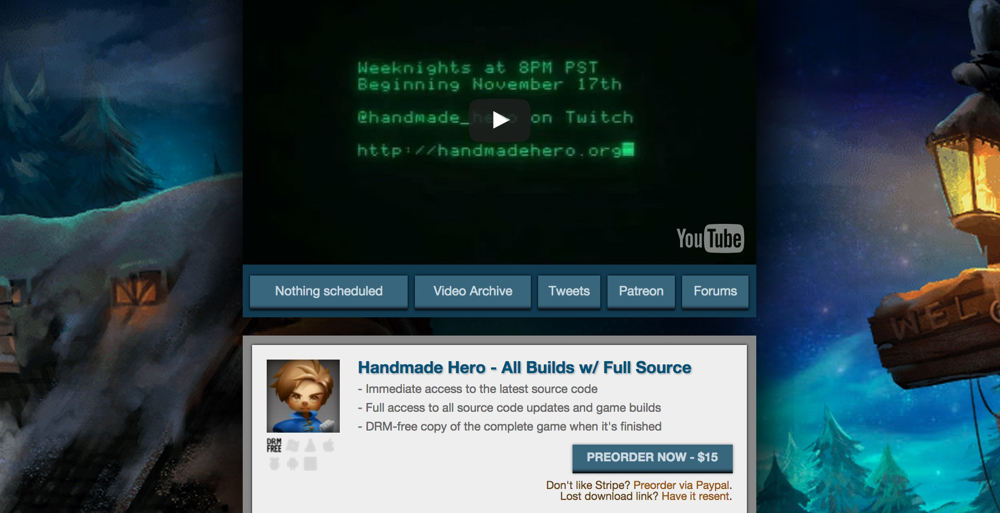

  <h1>
    <a href="https://handmadehero.org/">Handmade Hero</a>
  </h1>

  

## Intro

This is my personal study notes of [Handmade Hero](https://handmadehero.org).

If you think __writing a professional-quality game from scratch on your own (no engine no library)__ is interesting and challenging, I highly recommend this project. In my opinion, it's the best I can find.

Deepest thanks to _Casey Muratori_ for this excellent project. It's really awesome.

## Env

Windows 10 with Visual Studio 2019 community version and Sublime Text 3.

## Code Style

My preferred code style for C is different from Casey's.

- snake_case for types, e.g. `game_world`
- camelCase for variables, e.g. `globalRunning`
- PascalCase for functions and macro functions, e.g. `GameUpdateVideo`
- UPPER_SNAKE_CASE for macro constants, e.g. `TILES_PER_CHUNK`

## Marks

- `NOTE`: Something we need to pay attention to
- `PLAN`: Something we plan to do it later
- `RESOURCE`: External valuable resource
- `DIFF`: Something I have done it differently from Casey
- `FUN`: Something interesting to know, like Windows can't correctly handle file formats they invented
- `OPINION`: Casey's opinion about programming

## Windows Programming

### Command Prompt

- `dir /s [keyword]`: search files
- `findstr -s -n -i -l [keyword]`: find strings

### Win32 API

- `WS_EX_TOPMOST`: make window in front of others
- `WS_EX_LAYERED` and `SetLayeredWindowAttributes `: change window alpha

### Visual Studio

- `Spy++`: inspect windows and messages

## Roadmap

<!-- MarkdownTOC -->

- [Day 1: Setting Up the Windows Build](#day-1-setting-up-the-windows-build)
- [Day 2: Opening a Win32 Window](#day-2-opening-a-win32-window)
- [Day 3: Allocating a Back Buffer](#day-3-allocating-a-back-buffer)
- [Day 4: Animating the Back Buffer](#day-4-animating-the-back-buffer)
- [Day 5: Windows Graphics Review](#day-5-windows-graphics-review)
- [Day 6: Gamepad and Keyboard Input](#day-6-gamepad-and-keyboard-input)
- [Day 7: Initializing DirectSound](#day-7-initializing-directsound)
- [Day 8: Writing a Square Wave to DirectSound](#day-8-writing-a-square-wave-to-directsound)
- [Day 9: Variable-Pitch Sine Wave Output](#day-9-variable-pitch-sine-wave-output)
- [Day 10: QueryPerformanceCounter and RDTSC](#day-10-queryperformancecounter-and-rdtsc)
- [Day 11: The Basics of Platform API Design](#day-11-the-basics-of-platform-api-design)
- [Day 12: Platform-Independent Sound Output](#day-12-platform-independent-sound-output)
- [Day 13: Platform-Independent User Input](#day-13-platform-independent-user-input)
- [Day 14: Platform-Independent Game Memory](#day-14-platform-independent-game-memory)
- [Day 15: Platform-Independent Debug File](#day-15-platform-independent-debug-file)
- [Day 16: Visual Studio Compiler Switches](#day-16-visual-studio-compiler-switches)
- [Day 17: Unified Keyboard and Gamepad Input](#day-17-unified-keyboard-and-gamepad-input)
- [Day 18: Enforcing a Video Frame Rate](#day-18-enforcing-a-video-frame-rate)
- [Day 19: Improving Audio Synchronization](#day-19-improving-audio-synchronization)
- [Day 20: Debugging the Audio Sync](#day-20-debugging-the-audio-sync)
- [Day 21: Loading Game Code Dynamically](#day-21-loading-game-code-dynamically)
- [Day 22: Instantaneous Live Code Editing](#day-22-instantaneous-live-code-editing)
- [Day 23: Looped Live Code Editing](#day-23-looped-live-code-editing)
- [Day 24: Win32 Platform Layer Cleanup](#day-24-win32-platform-layer-cleanup)
- [Day 25: Finishing the Win32 Prototyping Layer](#day-25-finishing-the-win32-prototyping-layer)
- [Day 26: Introduction to Game Architecture](#day-26-introduction-to-game-architecture)
- [Day 27: Exploration-based Architecture](#day-27-exploration-based-architecture)
- [Day 28: Drawing a Tilemap](#day-28-drawing-a-tilemap)
- [Day 29: Basic Tilemap Collision Checking](#day-29-basic-tilemap-collision-checking)
- [Day 30: Moving Between Tilemaps](#day-30-moving-between-tilemaps)
- [Day 31: Tilemap Coordinate Systems](#day-31-tilemap-coordinate-systems)
- [Day 32: Unified Position Representation](#day-32-unified-position-representation)
- [Day 33: Virtualized Tilemaps](#day-33-virtualized-tilemaps)
- [Day 34: Tilemap Memory](#day-34-tilemap-memory)
- [Day 35: Basic Sparse Tilemap Storage](#day-35-basic-sparse-tilemap-storage)
- [Day 36: Loading BMPs](#day-36-loading-bmps)
- [Day 37: Basic Bitmap Rendering](#day-37-basic-bitmap-rendering)
- [Day 38: Basic Linear Bitmap Blending](#day-38-basic-linear-bitmap-blending)
- [Day 39: Basic Bitmap Rendering Cleanup](#day-39-basic-bitmap-rendering-cleanup)
- [Day 40: Cursor Hiding and Fullscreen](#day-40-cursor-hiding-and-fullscreen)
- [Day 41: Overview of the Types of Math Used in Games](#day-41-overview-of-the-types-of-math-used-in-games)
- [Day 42: Basic 2D Vectors](#day-42-basic-2d-vectors)
- [Day 43: The Equations of Motion](#day-43-the-equations-of-motion)
- [Day 44: Reflecting Vectors](#day-44-reflecting-vectors)
- [Day 45: Geometric vs. Temporal Movement Search](#day-45-geometric-vs-temporal-movement-search)
- [Day 46: Basic Multiplayer Support](#day-46-basic-multiplayer-support)
- [Day 47: Vector Lengths](#day-47-vector-lengths)
- [Day 48: Line Segment Intersection Collision](#day-48-line-segment-intersection-collision)
- [Day 49: Debugging Canonical Coordinates](#day-49-debugging-canonical-coordinates)
- [Day 50: Basic Minkowski-based Collision Detection](#day-50-basic-minkowski-based-collision-detection)
- [Day 51: Separating Entities by Update Frequency](#day-51-separating-entities-by-update-frequency)
- [Day 52: Entity Movement in Camera Space](#day-52-entity-movement-in-camera-space)
- [Day 53: Environment Elements as Entities](#day-53-environment-elements-as-entities)
- [Day 54: Removing the Dormant Entity Concept](#day-54-removing-the-dormant-entity-concept)
- [Day 55: Hash-based World Storage](#day-55-hash-based-world-storage)
- [Day 56: Switching from Tiles to Entities](#day-56-switching-from-tiles-to-entities)
- [Day 57: Spatially Partitioning Entities](#day-57-spatially-partitioning-entities)
- [Day 58: Using the Spatial Partition](#day-58-using-the-spatial-partition)
- [Day 59: Adding a Basic Familiar Entity](#day-59-adding-a-basic-familiar-entity)
- [Day 60: Adding Hitpoints](#day-60-adding-hitpoints)
- [Day 61: Adding a Simple Attack](#day-61-adding-a-simple-attack)
- [Day 62: Basic Moving Projectiles](#day-62-basic-moving-projectiles)
- [Day 63 & 64 & 65 & 66: Major Refactoring with Simulation Region](#day-63--64--65--66-major-refactoring-with-simulation-region)
- [Day 67: Making Updates Conditional](#day-67-making-updates-conditional)
- [Day 68: Exact Enforcement of Maximum Movement Distances](#day-68-exact-enforcement-of-maximum-movement-distances)
- [Day 69: Pairwise Collision Rules](#day-69-pairwise-collision-rules)
- [Day 70: Exploration To-do List](#day-70-exploration-to-do-list)
- [Day 71: Converting to Full 3D Positioning](#day-71-converting-to-full-3d-positioning)
- [Day 72: Proper 3D Inclusion Test](#day-72-proper-3d-inclusion-test)

<!-- /MarkdownTOC -->

### Day 1: Setting Up the Windows Build

- Install Visual Studio 2019
- Call `vsdevcmd` to init command line tools
- Use `cl` to build our program
- Use `devenv` to start visual studio to debug. e.g. `devenv w:\build\win32_handmade.exe`
- `WinMain`: Entry of Windows program
- `MessageBox`: Show a message box

### Day 2: Opening a Win32 Window

- `WNDCLASS`, `RegisterClass`
- `GetModuleHandle`
- `OutputDebugString`
- `DefWindowProc`
- `CreateWindow`, `CreateWindowEx`
- `GetMessage`, `TranslateMessage`, `DispatchMessage`
- `BeginPaint`, `EndPaint`, `PatBlt`

### Day 3: Allocating a Back Buffer

- `PostQuitMessage`
- #define `global_variable` and `internal` to `static`
- Resize buffer when receive WM_RESIZE
- `GetClientRect`
- `CreateDIBSection`
- `StretchDIBits`
- `DeleteObject`
- `CreateCompatibleDC`
- `ReleaseDC`

### Day 4: Animating the Back Buffer

- Use `VirtualAlloc` to alloc bit map memory instead of `CreateDIBSection`
- `VirtualFree`, `VirtualProtect`
- Set `biHeight` to negative value so we the image origin if top-left
- Render a simple gradient. Each pixel has a value of form `0xXXRRGGBB`
- use `PeekMessage` instead of `GetMessage`, because it doesn't block
- `GetDC`, `ReleaseDC`

### Day 5: Windows Graphics Review

- `HREDRAW` and `VREDRAW` are used to tell Windows to redraw the whole window
- Use `win32_offscreen_buffer` to bundle all global variables
- Create the back buffer just once, move it out of `WM_SIZE`

### Day 6: Gamepad and Keyboard Input

- `XInput`, `XInputGetState`, `XInputSetState`, `XUSER_MAX_COUNT`
- Loading windows functions ourselves
- Use XInput 1.3
- `LoadLibrary`, `GetProcAddress`
- `WM_SYSKEYUP`, `WM_SYSKEYDOWN`, `WM_KEYUP`, `WM_KEYDOWN`
- Get IsDown and WasDown status from LParam

### Day 7: Initializing DirectSound

- Return `ERROR_DEVICE_NOT_CONNECTED` in xinput stub functions
- Implement `Alt+F4` to close the window
- Use bool32 if we only care if the value is 0 or not 0
- `dsound.h`, [IDirectSound8 Interface](https://docs.microsoft.com/en-us/previous-versions/windows/desktop/ee418035(v=vs.85))
- `DirectSoundCreate`, `SetCooperativeLevel`, `CreateSoundBuffer`, `SetFormat`
- Remember to clear `DSBUFFERDESC` to zero
- Add `MEM_RESERVE` to `VirtualAlloc`

### Day 8: Writing a Square Wave to DirectSound

- [IDirectSouondBuffer8 Interface](https://docs.microsoft.com/en-us/previous-versions/windows/desktop/ee418055%28v%3dvs.85%29)
- `Lock`, `Unlock`, `GetCurrentPosition`, `Play`

### Day 9: Variable-Pitch Sine Wave Output

- `sinf`
- `win32_sound_output`, `Win32FillSoundBuffer`
- `tSine`, `LatencySampleCount`
- We need to handle xinput deadzone in the future
- Use `DefWindowProcA` instead of `DefWindowProc`

### Day 10: QueryPerformanceCounter and RDTSC

- `QueryPerformanceCounter`, `LARGE_INTEGER`, `QuyerPerformanceFrequency`
- `wsprintf`, `__rdtsc`
- Intrinsic: looks like a function call, but it's used to tell the compiler we want a specific assembly instruction here

### Day 11: The Basics of Platform API Design

- Win32 platform todo list:
  - Saved game location
  - Getting a handle to our executable
  - Asset loading
  - Threading
  - Raw input (support for multiple keyboards)
  - Sleep/timeBeginPeriod
  - ClipCursor() (for multimonitor)
  - Fullscreen
  - WM_SETCURSOR (control cursor visibility)
  - QueryCancelAutoplay
  - WM_ACTIVATEAPP (for when we are not the active application)
  - Blit speed improvements
  - Hardware acceleration
  - GetKeyboardLayout (for French keyboards)
- For each platform, we will have a big [platform]\_handmade.cpp file. Inside this file, we #include other files.
- Treat our game as a service, rather than the operating system.

### Day 12: Platform-Independent Sound Output

- `_alloca`: Allocate some memory in the stack, freeed when the function exists rather than leave out of the enclosing scope
- Move sound rendering logic to handmade.cpp

### Day 13: Platform-Independent User Input

- Define `game_input`, `game_controller_input`, `game_button_state`
- Store OldInput and NewInput and do ping-pang at end of every frame
- Define `ArrayCount` macro

### Day 14: Platform-Independent Game Memory

- Use a `game_memory` struct to handle all memory related stuff
- We have permannent storage and trasient storage in our memory
- Define `Kilobytes`, `Megabytes` and `GigaBytes` macros
- We require the memory allocated to be cleared to zero
- Define `Assert` macro
- Use `cl -Dname=val` to define `HANDMADE_INTERNAL` and `HANDMADE_SLOW` compiler flags
- Specify base address when we do `VirtualAlloc` for debugging purpose in internal build

### Day 15: Platform-Independent Debug File

- Define `DebugPlatformReadFile`, `DebugPlatformWriteFile` and `DebugPlatformFreeFileMemory` only when we are using internal build
- Define `SafeTruncateUInt64` inline functions
- `CreateFile`, `GetFileSizeEx`, `ReadFile`
- `__FIEL__` is a compile time macro points to current file

### Day 16: Visual Studio Compiler Switches
- VS compiler switches:
  - `-WX`, `-W4`: enable warning level 4 and treat warnings as errors
  - `-wd`: turn off some warnings
  - `-MT`: static link C runtime library
  - `-Oi`: generates intrinsic functions.
  - `-Od`: disable optimization
  - `-GR-`: disable run-time type information, we don't need this
  - `-Gm-`: disable minimal rebuild
  - `-EHa-`: disable exception-handling
  - `-nologo`: don't print compiler info
  - `-FC`: full Path of Source Code File in Diagnostics
- Init `vsdevcmd` using `-arch=x86` flags to build a 32-bit version of our program
- Use `/link` to pass linker options to make a valid Windows XP executable
  - `-subsystem:windows,5.1`

### Day 17: Unified Keyboard and Gamepad Input

- Add one controller, so we have 5 controllers now
- Extract `CommonCompilerFlags` and `CommonLinkerFlags` in build.bat
- Copy old keyboard button state to new keyboard button state
- Add MoveUp, MoveDown, MoveLeft, MoveRight buttons
- Handle XInput dead zone
- Check whether union in game_controller_input is aligned

### Day 18: Enforcing a Video Frame Rate

- We need to find a way to reliably retrieve monitor refresh rate?
- We define `GameUpdateHz` based on `MonitorRefreshHz`
- Use `Sleep` to wait for the remaining time
- Use `timeBeginPeriod` to modify scheduler granularity

### Day 19: Improving Audio Synchronization

- Record last play cursor and write cursor
- Define `Win32DebugSyncPlay` to draw it
- Use a while loop to test direct sound audio update frequency

### Day 20: Debugging the Audio Sync

__The audio sync logic is indeed very hard and complicated__.

I didn't take many notes because I was really confused and I didn't understand much.

- Compute audio latency seconds using write cursor - play cursor
- Define `GameGetSoundSamples`

### Day 21: Loading Game Code Dynamically

- Compile win32_handmade and handmade separaely
- Define win32_game_code and
- Put platform debug functions to game memroy
- Enable `/LD` switch to build dll
- Use /EXPORT linker flags to export dll functions
- We don't need to define `DllMain` entry point in our dll
- extern "C" to prevent name mangling
- Turn off incremental link
- Use `CopyFile` to copy the dll

### Day 22: Instantaneous Live Code Editing

NOTE: `CopyFile` may fail the first time, We use a while loop to do it. This is debug code so We don't care the performance;

- Use /PDB:name linker options to specify pdb file name
- Add timestamp to output pdb file name
- Delete PDB files and pipe del output to NUL
- Use `FindFirstFile` to get file write time
- Use `CompareFileTime` to compare file time
- Use `GetModuleFileName` to get exe path and use it to build full dll path
- We can use MAX_PATH macro to define length of path buffer

### Day 23: Looped Live Code Editing

- Define `win32_state` to store InputRecordIndex and InputPlayingIndex, we only support one slot now
- Press L to toggle input recording
- Store input and memory into files
- Use a simple jump to test our looped editing
- We can use `WS_EX_TOPMOST` and `WS_EX_LAYERED` to make our window the top most one and has some opacity
- We can do it in `WM_ACTIVATEAPP` message so when the game loses focus it will be transparent

### Day 24: Win32 Platform Layer Cleanup

- Fix the audio bug (I have already fixed that in previous day)
- Change blit mode to 1-to-1 pixles
- Use `%random%` for pdb files
- Change compiler flag `MT` to `MTd`
- Store EXE directory in Win32State and put record input file to build dir
- Use `GetFileAttributeEx` instead of `FindFirstFile` to get last write time of a file

### Day 25: Finishing the Win32 Prototyping Layer

- Use `GetDeviceCaps` to get monitor refresh rate
- Pass `thread_context` from platform to game and from game to platform
- Add mouse info to game_input, using `GetCursorPos`, `ScreenToClient`
- Record mouse buttons using `GetKeyState`
- Define win32_replay_buffer and store game state memory in memory using `CopyMemory` (Storing in disk actually is very fast in my computer, but I am gonna do it anyway)
- I am not gonna do memory mapping, because I think it's unnecessary

### Day 26: Introduction to Game Architecture

Today there isn't any code to write. I am just listening to Casey talking about what a good game architecture looks like.

In Casey's view, game architect is like a __Urban Planner__. Their job are organizing things roughly instead of planning things carefully. I can't agree more.

### Day 27: Exploration-based Architecture

- Add `SecondsToAdvanceOverUpdate` to game_input
- Remove debug code
- Turn off warning C4505, it's annoying. We are gonna have unreferenced local functions.
- Target resolution: 960 x 540 x 30hz
- Define `DrawRectangle`

### Day 28: Drawing a Tilemap

- Use floating point to store colors, because it will make it a lot more eaiser when we have to do some math about colors
- Draw a simple tilemap
- Draw a simple player, keep in mind that player's moving should consider the time delta. Otherwise it will move fast if we run at a higher FPS.

### Day 29: Basic Tilemap Collision Checking

- Using `PatBlt` to clear screen when display our buffer
- We should only clear the four gutters otherwise there will be some flashing
- Implement a simple collision check
- Seperate the header file into handmade.h and handmade_platform.h

### Day 30: Moving Between Tilemaps

- Define four tilemaps, and notice that in C the two dimension array is Y first and X last
- Define `canonicol_position` and `raw_postion`
- Implement moving between tilemaps

### Day 31: Tilemap Coordinate Systems

- NOTE: Basically any CPU we are gonna target at has SSE2
- Define `handmade_intrinsic.h`
- Define `TileSizeInMeters` and `TileSizeInPixels`
- Optimization switches: `/O2 /Oi /fp:fast`
- PLAN: Pack tilemap index and tile index into a single 32-bit integer
- PLAN: Convert TileRelX and TileRelY to resolution independent world units
- RESOURCE: Intel Intrinsics Guide, https://software.intel.com/sites/landingpage/IntrinsicsGuide/

### Day 32: Unified Position Representation

- Remove `raw_position`
- Add `canonical_postion PlayerPos` to game state
- Define `RecononicalizePosition`
- Use meters instead of pixels as units

### Day 33: Virtualized Tilemaps

- Rename `canonical_position` to `world_position`
- Make Y axis go upward
- RESOURCE: a great book about typology: *Galois' Dream: Group Theory and Differential Equations*
- Remove TileMapX and TileMapY
- Define `tile_map_position`
- 24-bit for tilemap and 8-bit for tiles
- Implement a simple scroll so the guy can move

### Day 34: Tilemap Memory

- Implement smooth scrolling
- Implement a way to speed the guy up
- Make `TileRelX` and `TileRelY` relative to center of tile
- Create `handmade_tile.h` and `handmade_tile.cpp`
- Rename `tile_map` to `tile_chunk` and extract everything from `world` to `tile_map`, now tilemap means the whole map
- Define `memory_arena` and `PushSize`, `PushArray` and create tile chunks programmatically

### Day 35: Basic Sparse Tilemap Storage

- Make tile size small so we can see more chunks
- Remove `TileSizeInPixels` and `MetersToPixels` from `tile_map`
- Use random.org to generate some random numbers and use them to generate screen randomly
- Generate doors based on our choice
- Allocate space for tiles only when we access
- Add Z index to tilemap

### Day 36: Loading BMPs

- FUN: Windows can't render BMPs correct. This is very amusing, because they are the guys who invented BMP.
- Make player go up and down. I already implemented this function in the previous day, but I need to reimplement it in a new way: when the player moves to the stair, it goes automatically, no need to push any button.
- Rename `TileRelX` and `TileRelY` to `OffsetX` and `OffsetY`
- Define `bitmap_header` and parse bitmap. We have to use `#pragma pack(push, 1) and #pragma pack(pop)` to make vs pack our struct correctly

### Day 37: Basic Bitmap Rendering

- Design a very specific BMP to help debug our rendering. This is a very clever method.
- I find that my structured_art.bmp has different byte order from casey's. It turns out that BMP has something called RedMask, GreenMask, BlueMask and AlphaMask.
- BMP byte order: should determined by masks
- Render background bmp
- Define `loaded_bitmap` to pack all things up
- Define `DrawBitmap`

### Day 38: Basic Linear Bitmap Blending

- Define `FindLeastSignificantSetBit` and `bit_scan_result` in intrinsics
- Define `COMPILER_MSVC` and `COMPILER_LLVM` macro variables
- Use `_BitScanForward` MSVC compiler intrinsic when we are using windows
- Implement a simple linear alpha blending
- Assert compression mode when loading BMP

### Day 39: Basic Bitmap Rendering Cleanup

- Load hero bitmaps for four directions
- Change hero direction when moves
- Align hero bitmaps with real position
- Replace camera scrolling with fixed camera
- Move camera when player moves
- Fix clipping problem in our bitmap drawing
- Check frame rate
- Fix msvc pdb problem when hot reloading by creating a lock file

### Day 40: Cursor Hiding and Fullscreen

- Write a `static_check` bat file to make sure we never type `static`
- Set a default cursor style using `LoadCursor`
- Hide cursor by responding `WM_SETCURSOR` message with `SetCursor(0)` in production build
- RESOURCE: How do I switch a window between normal and fullscreen? https://devblogs.microsoft.com/oldnewthing/20100412-00/?p=14353
- Implement full screen toggling
- Do fullscreen rendering in fullscreen mode

### Day 41: Overview of the Types of Math Used in Games

Math we are gonna need:

- Arithmetic
- Algebra
- Euclidean Geometry
- Trigonometry
- Arithmetic
- Calculus
- Linear Algebra
- Partial Differential Equation
- Ordinary Differential Equation
- Complex Numbers
- Non-Euclidean Geometry
- Topology
- Minkowski Algebra
- Control Theory
- Interval Arithmetic
- Graph Theory
- Operations Research
- Probability and Statistics
- Cryptography / Pseudo Number Generator

### Day 42: Basic 2D Vectors

- Fix diagonal movement problem
- Define `v2` and implement add operator, minus operator and unary minus operator in `handmade_math.h`
- Use v2 instead of x and y

### Day 43: The Equations of Motion

- Add `dPlayerP` to game state. This is the speed of the guy.
- Add a back force based on player's speed

### Day 44: Reflecting Vectors

- Implement inner product for vectors
- Reflect speed when player hits the wall (or make the speed align the wall). This can be implemented by a clever verctor math `v' = v - 2 * Inner(v, r) * r`. r means the vector of the reflecting direction. For bottom wall, r is `(0, 1)`.

### Day 45: Geometric vs. Temporal Movement Search

- OPINION: Search in p (position) is way better than searing in t (time)
- Part of new collision detection algorithm
- There is no code today. I will write the new collision detection algorithm when it's complete.

### Day 46: Basic Multiplayer Support

- We have a severe bug! Player has been moved multiple times!
- Define `entity` struct. Add `Entities`, `EntityCount`, `PlayerIndexForController` and `CameraFollowingEntityIndex` to game state
- Support as many players as our controllers in game state
- Implement `RotateLeft` and `RotateRight` intrincsics using `_rotl` and `_rotr`

### Day 47: Vector Lengths

- Define `Length`, `SquareRoot` to fix diagonal movement problem
- We will ue **search in t instead of search in p**. Because to implement the later, we have to build the whole search space. It's complex and doesn't pay off.
- Part of new collision detection algorithm

### Day 48: Line Segment Intersection Collision

- Implement the new collistion detection algorithm
- Add a `tEpsilon` to tolerate floating point problem

### Day 49: Debugging Canonical Coordinates

- Add an `Offset` method to manipulate tile map position and auto recononicalize
- Maybe we shouldn't make the world toroidal, since it adds much complexity

### Day 50: Basic Minkowski-based Collision Detection

- Introduction of Minkowski sum and GJK algorithm
- Implement area collision detection
- Take player area into account when calculating MinTileX, MaxTileX, MinTileY and MaxTileY
- Modify speed when player hits the wall
- Use a loop to move player

### Day 51: Separating Entities by Update Frequency

- Divide entities into high, low and dormant categories
- Define `entity_residence` enum
- Casey did part of the new implementation
- No code today. I will wait till the new implementation is finished

### Day 52: Entity Movement in Camera Space

- Make player move again
- Map float position to tile map position after moving player
- Make camera move again

### Day 53: Environment Elements as Entities

- Define `SetCamera` and move entities into/out of high set
- Define `entity_type` and add wall entities
- Remove `tRemaining` in collision detection

### Day 54: Removing the Dormant Entity Concept

- Remove dormant entity and entity residence concept
- Define `MakeEntityHighFrequency` and `MakeEntityLowFrequency`
- Make code work again
- DIFF: I don't like all the index thing. I will use pointers instead.

### Day 55: Hash-based World Storage

- Use int32 as chunk index, so 0 will be the center.
- Add `TileChunkHash` to tile map
- `GetTileChunk` should take a memroy arena
- DIFF: I will store pointers instead of index in TileChunkHash array

### Day 56: Switching from Tiles to Entities

- Rename `CameraBound` to `HighFrequencyBound`
- Rename `handmade_tile.h/cpp` to `handmade_world.h/cpp`
- Rename tile chunk to world chunk. We dont have *tiles* anymore.

### Day 57: Spatially Partitioning Entities

- There is no tiles any more, just chunks.
- Define `entity_block` and `ChangeEntityLocation`
- Implement `WorldPositionFromTilePosition`

### Day 58: Using the Spatial Partition

- Reimplement `SetCamera` using spatial partition
- Call `ChangeEntityLocation` when adding low entities
- Load tree bitmap and render it as wall

### Day 59: Adding a Basic Familiar Entity

- Add monster and familiar entity type
- Define `entity_render_piece` and `entity_render_piece_group`
- Implement `UpdateFamiliar`

### Day 60: Adding Hitpoints

- Define `hit_point` struct
- Draw hit points
- Define `v3` and `v4` vectors

### Day 61: Adding a Simple Attack

- OPINION: Always write the usage code first. It will prepare you necessary context for writing real stuff.
- Add `EntityType_Sword` entity type
- Define `DrawHitPoints()` and `InitHitPoints()` and add hitpoints for our monster
- Load *rock03.bmp* as sword and render it when some key is pressed
- Define `NullPosition()` and `IsPositionValid()`. Use some specific value to represent a null position.

### Day 62: Basic Moving Projectiles

- Define `move_spec` and pass it to `MoveEntity`
- Add `distanceRemaining` to sword
- Define `UpdateSword` and make sword disappaer when distance remaining reaches to zero

### Day 63 & 64 & 65 & 66: Major Refactoring with Simulation Region

This is a big change but it defeinitely worth it.

- Remove `low_entity` and `high_entity`. They are never a good idea.
- Define `sim_entity` and `stored_entity`. `stored_entity` is for storage and `sim_entity` is for simulation.
- Every frame, pull relevant entities to our simulation region, simulate it and render it.
- Lots of modifications adjusted for this new model

### Day 67: Making Updates Conditional

- Add `updatable` to sim entity and set it correspondingly
- Add `updatableBounds` to sim region. Previous bounds becomes total bounds.
- `LoadEntityReference` should get position from reference entity
- `UpdateSword` doesn't have to check NonSpatial flag
- Move update logic back to our main function
- OPINION: Avoid callbacks, plain switch statements are just better on every aspect.

### Day 68: Exact Enforcement of Maximum Movement Distances

- Consider `distanceLimit` in moveEntity function
- OPINION: Fight the double dispatch problem with a property system.
- Define a simple `HandleCollision` function to make sword hurt monster when they collides

### Day 69: Pairwise Collision Rules

- Remove `EntityFlag_Collides`
- Define `ShouldCollide` to check whether two entities should collide
- Define `pairwise_collision_rule`
- Add `collisionRuleHash` and `firstFreeCollisionRule` to game state
- Define `AddCollisionRule` and `ClearCollisionRulesFor`

### Day 70: Exploration To-do List

- One way to fix `ClearCollisionRulesFor` function: every time we just insert two entries so that we can query with each one.

To-do list:

- Multiple sim regions per frame
  - Per-entity clocking
  - Sim-region merging? For multiple players?
- Z!
  - Clean up things by using v3
  - Figure out how you go "up" and "down", and how is this rendered?
- Collision detection?
  - Entry/exit?
  - What's the plan for robustness? / shape definition?

- Debug code
  - Logging
  - Diagramming
  - Switches / slides / etc.

- Audio
  - Sound effect triggers
  - Ambient sounds
  - Music
- Asset streaming

- Metagame / save game?
  - Do we allow saved games? Probably yes, just only for "pausing".
  - Continuous save for crash recovery?
- Rudimentary world generation
  - Placement of background things
  - Connectivity?
  - Non-overlapping
  - Map display
    - Magnets - how they work???
- AI
  - Rudimentary monster behavior example
  - Path finding
  - AI "storage"

- Animation system
  - Skeletal animation
  - Partical system
- Rendering
- GAME
  - World generation
  - Entity system

### Day 71: Converting to Full 3D Positioning

- Remove `world_diff`
- Remove `chunkSizeInMeters` and add `chunkDimInMeters`
- Define `Hadamard` for v2 and v3
- Make `p` and `dP` v3 in sim entity
- Define `rectangle3`

### Day 72: Proper 3D Inclusion Test

- Implement the simple jump (Casey implemented this long time ago)
- `AABB`: Axis aligned bounding boxes
- Add `maxEntityRadius`, `maxEntityVelocity` to sim region
- Change `width` and `height` in sim entity to `dim`
- Define `EntityOverlapsRectangle` and use this method to test whether entity is inside a rectangle
